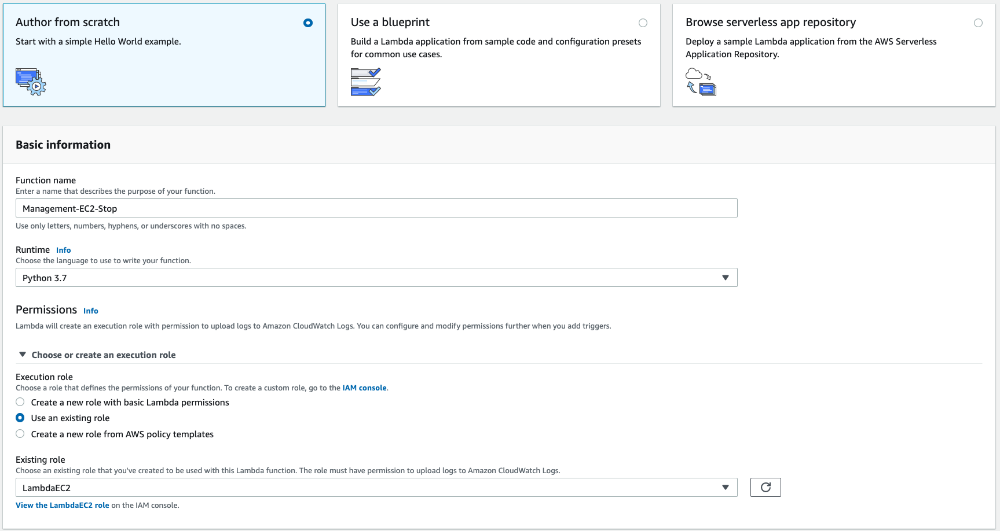
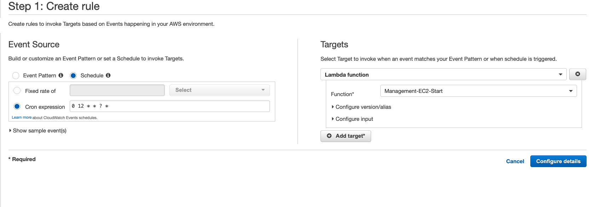

# Como economizar na AWS com dicas práticas!

Durante o Webinar ministrado na 2º Temporada do NPO Series, falaremos sobre algumas dicas práticas de como economizar na AWS.

Passando por conceitos de RIs, Saving Plans, AWS Budget, Cost Optimizer, também iremos implementar um AWS Lambda que funciona como um relógio para ligar e desligar os ambientes de desenvolvimento e homologação da sua conta.


Existem algumas formas de fazer isto, seja por Tags, por região... Porém para fins de demonstração, iremos fazer baseado em uma lista de instâncias EC2.


# Arquitetura


# Códigos

Utilizaremos Python3.7 com o SDK boto3.

Função de STOP:

```
import boto3
region = 'us-east-1'
instances = ['iddainstancia', 'iddainstancia']
ec2 = boto3.client('ec2', region_name=region)

def lambda_handler(event, context):
    ec2.stop_instances(InstanceIds=instances)
    print('Desligando Instancias as 21h: ' + str(instances))
```

Função de START:

```
import boto3
region = 'us-east-1'
instances = ['iddainstancia', 'iddainstancia']
ec2 = boto3.client('ec2', region_name=region)

def lambda_handler(event, context):
    ec2.start_instances(InstanceIds=instances)
    print('Desligando Instancias as 09h: ' + str(instances))
```

# Configurações

- Criar uma Role com permissões para o Lambda fazer stop e start de EC2:

    - No console de IAM, clique em Roles;
    
    - Clique em Create Role
    - Selecione o serviço AWS Lambda e clique em Next
    
    - Nas policies, pesquise por EC2FullAccess, selecione
    
    - Clique em Next, Next e coloque um nome na Role
    
    - Clique em Create role.

- Criar duas funções Lambda com os códigos acima:

    - No serviço AWS Lambda, clique em Create Function
    - Deixe selecionada a opção Author from Scratch, e de um nome para função;
    - Selecione o Runtime Python3.7
    - Selecione a Role que criamos no step anterior
    
    - Clique em Create Function
    - Na tela seguinte, cole os códigos correspondentes da sessão #Códigos deste documento e clique em Save;

- Criar dois agendamentos do Cloudwatch Events:
    - No serviço de CloudWatch, embaixo da opção Events, clique em Rules.
    
    - Clique em Create Rule
    - Selecione a opção Schedule e faça o agendamento de acordo com os seus horarios. No exemplo, utilizaremos os horarios de 09h para start e 21h para stop;
    - Para entender o Cron Expression, veja a [DOCUMENTAÇÃO](https://docs.aws.amazon.com/AmazonCloudWatch/latest/events/ScheduledEvents.html).
    - Uma vez que estamos no horário de Brasilia (GMT -3) utilizaremos sempre 3 horas adiante: `0 12 * * ? *`(Start) e `0 00 * * ? *` (STOP);
    - Em targets, selecione a função Lambda correspondente
    
    - Clique em Next, de um nome para o agendamento e clique em Create.


### Pronto! Suas instâncias EC2 tem agendamento de start e stop para te ajudar economizar enquanto não estão sendo utilizadas. 
